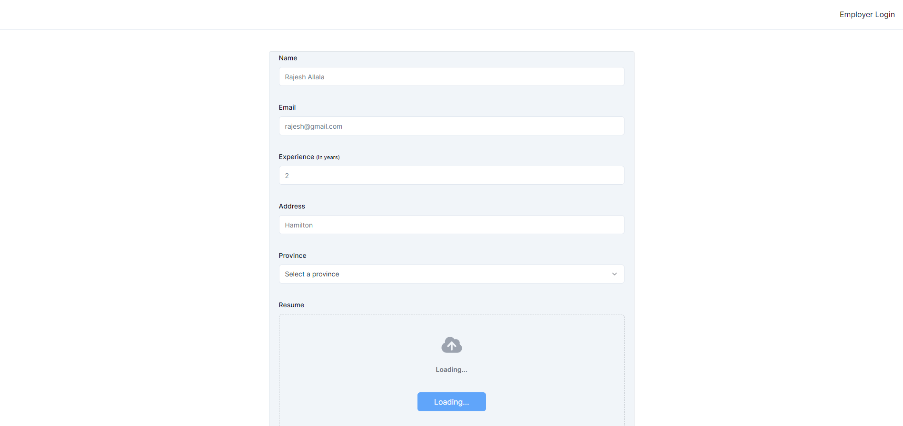

# HR CRM / CRM for Human Resources

Web Application

## Getting Started

This guide will walk you through setting up and running the HR CRM web application. The project is built and validated using the following technologies:

- Next.js (v.14.2.3)
- React (v.18)
- Resend (v.3.2)
- Uploadthing (v.6.5.4)
- shadcn /ui
- clerk/nextjs (v.5.1.2)

## Prerequisites

Ensure you have the following software installed on your machine:

- Node.js (v.16 or higher)
- npm (v.8 or higher)
- Git

## Setup

1. Clone the repository using the following command:

```bash
git clone https://github.com/deva961/tempx.git
```

Alternatively, you can download the repositary as a zip file and extract it.

2. Install packages
   Navigate to the downloaded folder and install the necessary packages:

```bash
npm install
```

3. Configure Environment Variables
   Copy the `.env.local` file to `.env`:

```bash
cp .env.local .env
```

4. Obtain API Keys
   Visit the websites for MongoDB, Clerk, and Resend to obtain your private keys. Update your .env file with the following content:

```bash
DATABASE_URL=********
UPLOADTHING_SECRET=**********
UPLOADTHING_APP_ID=******
RESEND_API_KEY=*****
NEXT_PUBLIC_CLERK_PUBLISHABLE_KEY=*****
CLERK_SECRET_KEY=******

NEXT_PUBLIC_CLERK_SIGN_IN_URL=/sign-in
NEXT_PUBLIC_CLERK_SIGN_UP_URL=/sign-up
NEXT_PUBLIC_CLERK_AFTER_SIGN_IN_URL=/hirings
NEXT_PUBLIC_CLERK_AFTER_SIGN_UP_URL=/hirings
```

5. Generate Prisma Client
   Generate the Prisma client and push the database schema:

```bash
npx prisma generate
npx prisma db push
```

6. Start the Development Server

```bash
npm run dev
```

Open your browser and navigate to `http://localhost:3000` to access the landing page.

# Work Flow / Screen Flow

### Home Screen

The home screen is the entry point to the HR CRM application.

- Screen Link: `http://localhost:3000`
- Screenshot:
  

### Login Screen

Users can sign in to access their accounts.

- Screen Link: `http://localhost:3000/sign-in`
  -Screenshot:
  

### Hiring Overview

After signing in, users are directed to the hiring overview page.

- Screen Link: `http://localhost:3000/hirings`
- Screenshot:
  

- Screenshot: `http://localhost:3000/hirings`
  

### Hiring Details

Users can view detailed information about specific hirings.

- Screen Link: `http://localhost:3000/hirings/[id]`
- Screenshot:
  

## Contributing

We welcome contributions! Please fork the repository and submit a pull request with any improvements or fixes.
